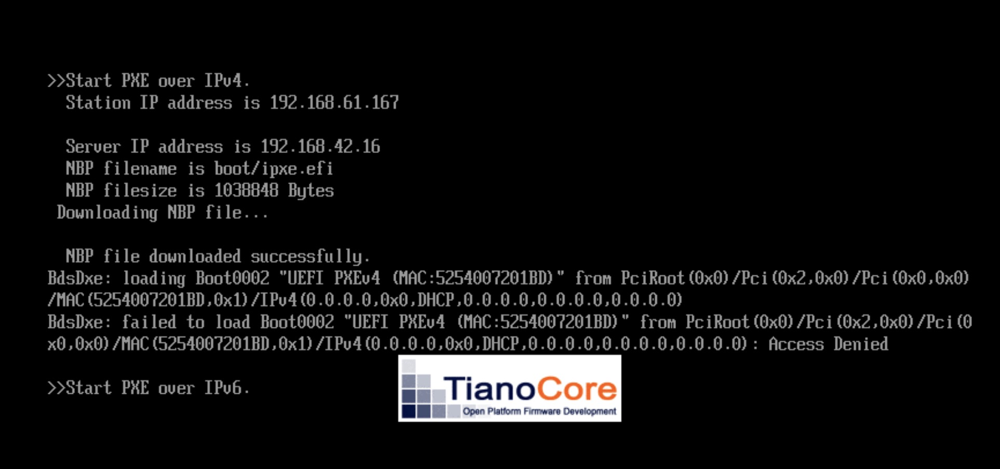

# BareMetalHost <> iPXE Bridge

- **Container Image:** quay.io/kenmoini/bmh-ipxe-bridge:latest
- Kubernetes/OpenShift Deployment: [./deploy/](./deploy/)

> **Goal**: To easily boot PXE/iPXE enabled systems automatically based on what is defined as BareMetalHost objects.

When running Advanced Cluster Management/Multicluster Engine, you can leverage the Assisted Service and BareMetalHosts via Host Infrastructure asset management.

Naturally, you can use the BareMetalHost objects to automatically boot many enterprise servers over their BMC (iDRAC/iLO/Redfish/etc) and load into an ISO created by the Assisted Service.  It's amazing.

You can also use the BareMetalHost CRs to boot systems via iPXE boot loader chaining.  The iPXE script is stored in the InfraEnv CR's `.status.bootArtifacts` and can boot a variety of hosts.  If a booted host is already defined as a BareMetalHost then if they have a MAC address that matches the `.spec.bootMACAddress` they will be assigned to its configuration - if it does not match a pre-defined BareMetalHost then it'll be a host listed in the InfraEnv as "Discovery ISO".

- **Problem**: While the InfraEnv and Assisted Service provide the iPXE script, you have to point to a very long link, and some hosts break accessing the long link with parameters.
  
  **Solution**: This app lets you proxy assets like the iPXE script via `$URI/boot-artifacts/ipxeScript/$INFRA_ENV_NAME`

- **Problem**: To systems with normal PXE boot, you need to configure your DHCP server to point to a custom baked iPXE bootstrap image that can either be statically configured or pointing to another hosted script available on the network that can be dynamically generated/changed.
  
  **Solution**: Instead of having to make a custom script for iPXE to load different BareMetalHosts from a variety of InfraEnvs, and updating that every time the InfraEnv configuration changes, this app will automatically enumerate through the InfraEnvs, their BareMetalHosts, map the defined bootMACAddress, and dynamically generate the needed iPXE script to provision all the hosts.

So to meet our goal we have to do a few things

1. [Deploy TFTP](./extras/tftp-container.md)
2. Deploy this service - [Python](#deployment---python) | [Container](#deployment---container) | [Kubernetes](#deployment---kubernetesopenshift)
3. [Create a custom iPXE script/boot image pointing to this service](#create-a-custom-ipxe-boot-image)
4. [Copy the iPXE boot image to the TFTP server](#serve-the-pxe-boot-image-via-tftp)
5. [Configure DHCP to use that TFTP server/file](#configure-dhcp-to-use-pxe)
6. Boot systems
7. ????????
8. PROFIT!!!!!!1

> You can deploy this application either by running the Python script, as a container image, or on Kubernetes/OpenShift - examples/instructions assume OpenShift due to use of Routes.

---

## Deployment - Python

```bash
# Install the needed python packages - maybe do this via a venv is you like
python3 -m pip install -r container_root/opt/app-root/src/requirements.txt

# Venv example
python3 -m venv venv
source venv/bin/activate
python3 -m pip install -r container_root/opt/app-root/src/requirements.txt

# Set the URI for the proxy service - this is used in the iPXE script for hosts to boot from
# If this is a hostname, make sure your DHCP server provides a DNS server
export FLASK_URI="http://hostname-or-ip:port"

# Do an oc login
oc login ...

# Run the script
python3 container_root/opt/app-root/src/server.py

# Exit the venv
deactivate
```

## Deployment - Container

```bash
# Assuming the host this container is running on is 192.168.42.42

# Run the container
podman run --rm -d \
 --name bmh-ipxe-bridge \
 -p 9876:9876 \
 -e FLASK_URI="http://192.168.42.42:9876" \
 -e KUBECONFIG="/opt/.kube.conf" \
 -v ~/.kube/config:/opt/.kube.conf:ro \
 quay.io/kenmoini/bmh-ipxe-bridge:latest

# You can also build the container yourself if you don't trust me (you shouldn't, I'm a stranger to you probably)
podman build -t bmh-ipxe-bridge -f Containerfile .
```

That kubeconfig file passed into the container will need to either have the original kubeadmin file for the cluster, or one created from a ServiceAccount with a long-lived token and needed RBAC (see `deploy/rbac.yaml`), or a Client Certificate user with the needed RBAC.

## Deployment - Kubernetes/OpenShift

If you're deploying this on non-OpenShift clusters where you don't have Routes, then remove that from the `deploy/kustomization.yaml` file and add your Ingress object as needed.

> For any K8s/OCP deployment, there is one modification to be made

In the `deploy/deployment.yaml` file there is the `FLASK_URI` environment variable that needs to be changed to point to where your specific service is being hosted from.

```bash
# Deploy things - defaults to multicluster-engine namespace
oc apply -k deploy/
```

---

## API Endpoints

- `/` - Index, just gives some text output
- `/healthz` - Kubernetes health check endpoint - probably could be better
- `/ipxe-boot` - Dynamically generated iPXE script for all InfraEnvs/BMHs.  Kinda works, mostly doesn't.
- `/ipxe-mac-boot/<mac_address>` - Dynamically generated iPXE script per MAC address - this works.
- `/ipxe-mac-proxy/<mac_address>` - Proxy the iPXE script directly without rewriting, per MAC address - this also works.
- `/inventory` - Raw JSON output of the discovered and mapped assets
- `/boot-artifacts/<artifactType>/<name>` - Proxy for InfraEnv bootArtifacts. `artifactType` can be either `kernel`, `initrd`, `rootfs`, or `ipxeScript`.  `name` is the name of the InfraEnv to proxy the artifact from.

## Environment Variable Overrides

- `FLASK_URI` - Required if `FLASK_RUN_HOST` is not defined.  Default `{protocol}://{FLASK_RUN_HOST}:{FLASK_RUN_PORT}`.  This address is used in the iPXE script that is generated, so the hosts that are booting need to be able to reach/resolve this endpoint.
- `FLASK_RUN_PORT` - Default `9876`
- `FLASK_RUN_HOST` - Default `0.0.0.0`, can be used to limit listening address.
- `FLASK_TLS_CERT` - Optional, SSL/TLS certificate to use
- `FLASK_TLS_KEY` - Optional, SSL/TLS key to use
- `LOOP_TIMING` - Default `90` (seconds), time in between queries to the cluster and rebuilds of the InfraEnv/BMH mapped inventory and generated iPXE script.
- `ADDITIONAL_HOST_CONFIG_PATH` - Default "", path where additional iPXE host configuration is stored.

---

## Create a Custom iPXE Boot Image

DHCP will tell systems to go to a TFTP server and get a file.  We're going to make this file.

This boot image will be configured just as a bootstrap image that points to a more dynamic configuration provided by this service.

```bash
# Install needed packages - assumes Fedora 40+
dnf group install -y development-tools
dnf install -y syslinux-devel genisoimage mtools xz-devel git

# Clone iPXE
cd ~
git clone https://github.com/ipxe/ipxe.git
cd ipxe/src

# Create a configuration script
# This is an example of one hosted online by iPXE
# In case you want to test this works without configuring/deploying the service
cat > script.ipxe <<EOF
#!ipxe

dhcp
chain http://boot.ipxe.org/demo/boot.php
EOF

# Create a UEFI PXE image
make bin-x86_64-efi/ipxe.efi EMBED=script.ipxe

# Create a BIOS PXE image
make bin/undionly.kpxe EMBED=script.ipxe
```

You can use that example iPXE script just to test things - you'll need to modify it and recreate the PXE image to point to this hosted service.

An example of pointing to an IP, eg running the Python script or container:

```
#!ipxe

dhcp
chain http://192.168.42.42:9876/ipxe-mac-boot/${net0/mac}
```

An example of it running in OpenShift:

```
#!ipxe

dhcp
chain http://bmh-ipxe-bridge-multicluster-engine.apps.endurance-sno.d70.lab.kemo.network/ipxe-mac-boot/${net0/mac}
```

Once reconfigured, re-run the image generation command - it will compile much faster this time.

```bash
# Enter the src directory under where you cloned ipxe

# Create a UEFI PXE image
make bin-x86_64-efi/ipxe.efi EMBED=script.ipxe

# Create a BIOS PXE image
make bin/undionly.kpxe EMBED=script.ipxe
```

> Once the PXE boot image has been created, you can copy it to a path on your TFTP server.

## Serve the PXE boot image via TFTP

If your TFTP server is on a different system than the one you just made the custom PXE boot images on, just `scp FILE targetServer:/tftpboot/boot/`.

If you're following along and using the TFTP container, and using this all under the same system, then you can just copy the file to the right place:

```bash
# Copy the UEFI PXE Boot Image
cp ~/ipxe/src/bin-x86_64-efi/ipxe.efi /opt/c-tftp/volumes/boot/

# Copy the BIOS PXE Boot Image
cp ~/ipxe/src/bin/undionly.kpxe /opt/c-tftp/volumes/boot/
```

## Configure DHCP to use PXE

This part depends on what your router/gateway is.  The configuration is different on Unifi devices, pfSense/OPNSense, OpenWRT, etc.

One thing to note is that your network may only allow configuration of one PXE boot image, either BIOS or UEFI, for one type of architecture, likely x86_64.

If you need to configure BIOS and UEFI boot - and/or for multiple architectures - if your network doesn't allow configuring multiple conditions for boot image targets, you may need to deploy ISC DHCPd, create some configuration, and set your network's DHCP configuration to relay to the ISC DHCPd server.

Assuming you have the TFTP server running on a server with the IP `192.168.42.42`, for UEFI x86_64 systems, with the boot file located in `boot/ipxe.efi` on the TFTP root, the following examples should help you configure a few different networks:

### Unifi

In the Unifi Network console, navigate to Settings > Networks and select a network.  Expand the DHCP Service Management Options.  Set the Network Boot option to the IP of the TFTP server, and the filename to the file you're booting, eg for x86_64 UEFI it'd be `boot/ipxe.efi`


> Note: Make sure to set a DHCP distributed DNS server if you're using hostnames for the service URI.

### pfSense

> WIP

### OPNSense

> WIP

### ISC DHCPd

If you want to use multiple boot modes and architectures without having support for it in your core network appliance, then you'll need to configure it to act as a DHCP Relay, and forward request to an ISC DHCPd server.  You can deploy one with the example below:

```bash
# Install needed packages
dnf install -y dhcp-server

# Allow through the firewall
firewall-cmd --add-service=dhcp --permanent
firewall-cmd --reload

# Optional - configure static host assignments
mkdir -p /etc/dhcp/static-hosts

# Repeat for additional hosts
cat >> /etc/dhcp/static-hosts/${SYSTEM_HOSTNAME}.conf <<EOF
host ${SYSTEM_HOSTNAME} {
  hardware ethernet ${SYSTEM_MAC_ADDRESS};
  fixed-address ${SYSTEM_IP};
  option host-name "${SYSTEM_HOSTNAME}";
}
EOF

# Create DHCPd configuration
cat > /etc/dhcp/dhcpd.conf <<EOF
# General Configuration
default-lease-time 3600;
max-lease-time 7200;
option domain-name "$DHCP_DOMAIN";
option domain-name-servers $DHCP_DNS_SERVERS;
option routers $DHCP_GATEWAY;
option ntp-servers $DHC_NTP_SERVERS;
option arch code 93 = unsigned integer 16; # RFC4578
ddns-update-style none;

# Optional configuration files that can be loaded for static host IP reservations
# include "/etc/dhcp/static-hosts/HOSTNAME_HERE.conf";

# DHCP Configuration
subnet ${DHCP_SUBNET} netmask ${DHCP_NETMASK} {
  range ${DHCP_RANGE_START} ${DHCP_RANGE_END};
  default-lease-time 3600;
  max-lease-time 7200;
  
  class "pxeclients" {
    next-server ${PXE_SERVER_IP};
    match if substring (option vendor-class-identifier, 0, 9) = "PXEClient";
    # Paths are relative to location from TFTP root
    if option arch = 00:07 or option arch = 00:09 {
      # X86_64 UEFI
      filename "/EFI/x86_64/BOOTX64.EFI";
    } else if option arch = 00:0b {
      # Arm 64 UEFI
      filename "/EFI/aarch64/BOOTAA64.EFI";
    } else {
      # X86_64 BIOS
      filename "/BIOS/x86_64/pxelinux.0";
    }
  }
}
EOF

# Enable and start the service
systemctl enable --now dhcpd
```

## Additional Host Configuration

In case you want to use this service to boot systems that are not defined in ACM/MCE/BMH/InfraEnv/etc, you can create a file with the filename being a hyphen delimited MAC address, containing the iPXE script you want that system to boot.  An example is in the [additional-host-configs](./additional-host-configs/) folder.

Then provide it to the service by defining the `ADDITIONAL_HOST_CONFIG_PATH` environmental variable pointing to the path containing those files.

## Common Issues

### Access Denied/Unsigned/Missing Keys

If you get a response via DHCP, but your system is giving some error about "Access Denied" or "Unsigned image" or "Missing keys" or something of the sort then it's likely that you have Secure Boot enabled.  An example of what this looks like with a Libvirt/KVM VM using the UEFI Tianocore Secure Boot loader is below:



When building your own custom PXE boot image, you are not signing it with a Certificate Authority in the trust bundle stored in your BIOS.  This unsigned binary will not boot when Secure Boot is enabled.  **Disable Secure Boot to proceed.**